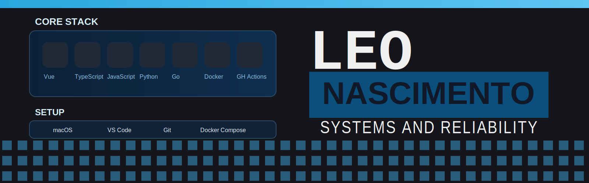

# Hi, I'm @leonardolimanas

Software engineer focused on practical products, AI integrations, SDKs, and DevOps workflows.
DevOps/SRE Manager leading platform reliability and engineering hiring processes.

### My Professional Social Media

### My Dev Stack

### My Setup

### Featured Repositories and Skills
- `doctor-nfse-website`: Vue, TypeScript, CSS, HTML, Shell, Dockerfile
- `sudoku-go-game`: JavaScript, Go, CSS, HTML
- `samuraibot`: Python, PHP
- `deriv-bot`: Python, TypeScript, CSS, Shell, JavaScript, HTML
- `feegow/devops-trial-task`: DevOps evaluation repository used in hiring process for your team (Prometheus, Alertmanager, Grafana, Loki, Tempo, k6)

### DevOps
- CI/CD pipeline design and maintenance
- Containerized workflows with Docker and Docker Compose
- Shell automation for repeatable engineering operations
- Build and release reliability practices
- Observability stack: Prometheus, Alertmanager, Grafana dashboards, Loki logs, Tempo tracing, k6 load testing

Example: `https://github.com/feegow/devops-trial-task`.

### GitHub Stats

  
  

